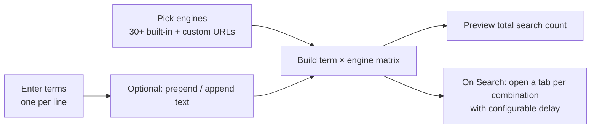

# MultiSearchX

> Search multiple terms across 30+ search engines at once — enter your terms, pick the engines, and fire every search in its own tab in one click.

[](LICENSE)
[](https://github.com/chirag127/multisearchx/stargazers)
[](https://github.com/chirag127/multisearchx/commits)
[](https://developer.mozilla.org/)

**Live site:** https://search.oriz.in · **GHP landing:** https://chirag127.github.io/multisearchx/ · **Repo:** https://github.com/chirag127/multisearchx

If this is useful, please ⭐ [star the repo](https://github.com/chirag127/multisearchx) — it helps others find it.

**100% client-side — no upload, no signup, no tracking.** All logic runs in your browser; nothing is sent to a server.

## How it works



## Features

- **Multiple terms at once** — one per line; each term opens its own tab per engine.
- **30+ search engines** — Google, DuckDuckGo, Bing, Perplexity, Brave, Phind, YouChat, and more.
- **Prepend / append text** — add modifiers to every search term.
- **Custom engines** — add any site that accepts a URL query.
- **Configurable delay** — space out tab opens so the browser doesn't choke.
- **Live count preview** — see exactly how many searches (terms × engines) will fire.
- **Bulk select** — select all engines or all AI engines at once.

## Tech stack

Vanilla **HTML**, **CSS**, and **JavaScript** — no framework, no build step, no backend. Served as static files; deployed on the Cloudflare/Pages free tier.

## Repo structure

```
multisearchx/
├── index.html   # markup: terms box, engine checkboxes, custom engines, controls
├── script.js    # search matrix builder, tab opener (delayed), live counter
├── styles.css   # layout + theme
├── CNAME        # search.oriz.in
└── LICENSE
```

## Quick start

No build step. Either:

- **Use it live:** https://search.oriz.in
- **Run locally:** clone the repo and open `index.html` in your browser (or serve the folder with any static server, e.g. `npx serve`).

## Usage

1. Go to https://search.oriz.in.
2. Enter search terms (one per line).
3. Select the search engines (or bulk-select all / all AI engines); optionally add custom engine URLs.
4. Click **Search** — a tab opens for each term × engine combination.

## Configuration

No configuration required — no env vars, no build. Options (engines, prepend/append text, delay) are set in the UI at runtime.

## Part of the oriz family

MultiSearchX is one of ~80 small, single-purpose tools in the [oriz](https://blog.oriz.in) family — each doing one thing well and running **$0 on the Cloudflare free tier**. Start at the hub, [oriz-home](https://oriz.in), or try a sibling like [oriz-dev](https://dev.oriz.in) (developer multitool).

## Contributing

Issues and PRs welcome. Keep it a single dependency-free static page; add new engines to the list in `index.html` / `script.js`. Conventional commits are the changelog.

## Status

Stable and live at https://search.oriz.in.

## License

MIT © Chirag Singhal — chirag@oriz.in
